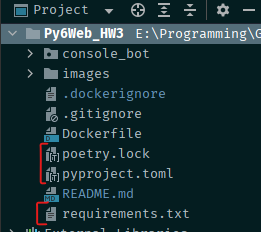
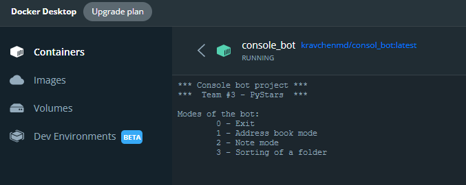
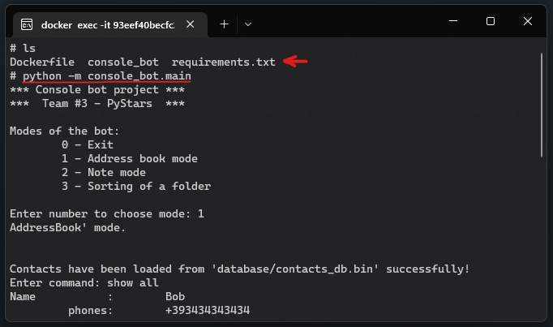
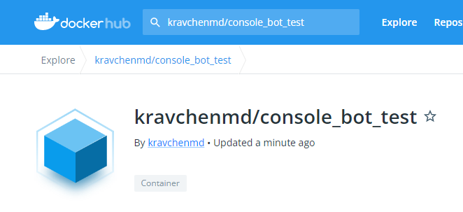

# Py6Web, HW 3. Kravchenko Michail

## Задание 1

- Виртуальное окружение создано с помощью `poetry`
- Сгенерированы файлы `.toml`, `.lock`
- Также сгенерировн файл `requirements.txt` для Docker

## Задание 2

*Прим.: Для корректной работы программы в контейнере пришлось убрать использование пакета `keyboard`*

- Собран Docker-образ
- Приложение запускается в контейнере

- Приложение запускается через CLI контейнера

Прим.: в `.dockerignore` добавлены файлы и папки, которые не нужно включать в Docker-образ (см. красную стрелку на картинке выше)

- Также образ был загружен на DockerHub (проверил - скачивается и работет):

